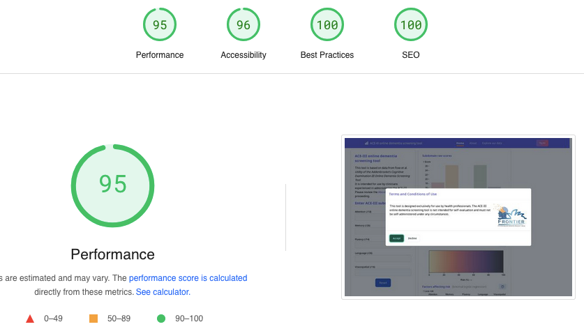
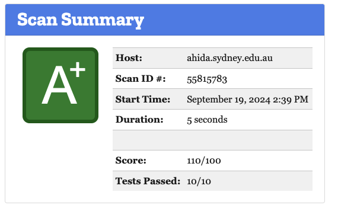

While you can test the code and logic for a website using automated
testing tools like [Vitest](https://vitest.dev/) or [Cypress](https://www.cypress.io/),
it can be harder to test what users see, and all the things that can
potentially impact their experience, like:

* Page load times
* Layouts that jump around and shift
* Accessibility for users with vision issues, or users of screen readers
* How your site looks when you share it to social media

There are a few automated tools that can provide quick and easy checks for
issues you might not spot otherwise.

## PageSpeed Insights (Google)

[PageSpeed Insights](https://pagespeed.web.dev/) gives a good overall breakdown
of loading times, accessibility, and general web development best practices,
giving you a simple overall score in each category and a breakdown
of the specific issues it flags:

You can also perform these checks directly from Chrome's dev tools - look for
the **Lighthouse** tab. You can use this to test sites that are only
running locally/in development mode.

## Mozilla Observatory

[Mozilla Observatory](https://observatory.mozilla.org/) can test your site for
some basic security issues, which is particularly important if you're accepting
data or authenticating users. It can be particularly useful for checking
that your site is using HTTPS correctly, as well as letting you know about
ways you could improve the site's [Content Security Policy](https://developer.mozilla.org/en-US/docs/Web/HTTP/CSP).

This is mostly relevant for sites where you're running your own server - for sites
hosted on GitHub Pages or similar services, you may not have much control over these
issues.

## OpenGraph Preview

[OpenGraph Preview](https://www.opengraph.xyz) can you show you how your site will look when
shared to social media, e.g. Facebook or Twitter. These previews [use meta tags](https://ogp.me/)
in the header of your site, and can be tricky to get right without previewing them.

## Accessibility Checker

Tools like [Accessibility Checker](https://www.accessibilitychecker.org) can provide a bit more
detail on accessibility flaws that PageSpeed flags - be aware that this one seems to warn
you a lot about potential lawsuits and tries to sell you services to fix it. But it does include
tools for checking the exact level of contrast between foreground and background, which
can be an important feature for users with vision issues.