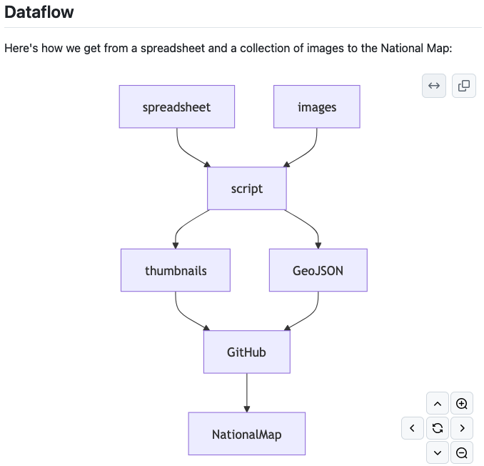

[Mermaid](https://github.com/mermaid-js/mermaid) is a JavaScript library for
generating diagrams from a simple text format. GitHub autogenerates Mermaid
diagrams for you if you include them in Markdown using triple-backticks:


````
    ## Dataflow

    Here's how we get from a spreadsheet and a collection of images to the 
    National Map: 

    ```mermaid
    graph TD;
        spreadsheet-->script;
        images-->script;
        script-->GeoJSON;
        script-->thumbnails;
        thumbnails-->GitHub;
        GeoJSON-->GitHub;
        GitHub-->NationalMap;
    ```

````


For learning how Mermaid works and debugging your diagrams, there's a [live editor](https://mermaid.live/).

There are a lot of these text-to-diagram tools around now: here's [a website which lets you compare their output interactively](https://text-to-diagram.com/).