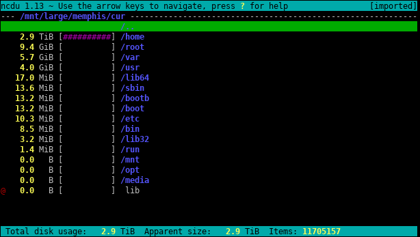

You might have used disk space analyzers like [WizTree](https://diskanalyzer.com/)
to find what's using up your hard drive space on your computer. 
If you're running out of room on a server, though, it can be a bit tougher to work
out what's chewing up space.

The first step is usually the `df` command to see how much space is used on
different volumes (the `-h` flag makes this more readable):

```
$ df -h
Filesystem    Size  Used Avail Use% Mounted on
devtmpfs       863M     0  863M   0% /dev
tmpfs          893M  168K  893M   1% /dev/shm
tmpfs          893M  9.5M  883M   2% /run
tmpfs          893M     0  893M   0% /sys/fs/cgroup
/dev/map       17G  6.9G   11G  41% /
```

For a better idea of the biggest directories and files though, you can use
[ncdu](https://dev.yorhel.nl/ncdu), which scans your entire filesystem
for you and finds the largest ones.

Run `sudo ncdu /` and you'll get an interactive interface like:



You can navigate into directories to see exactly which subfolders are taking up room.

You can install it in Ubuntu via `sudo apt install ncdu`, or on MacOS via `brew install ncdu`.