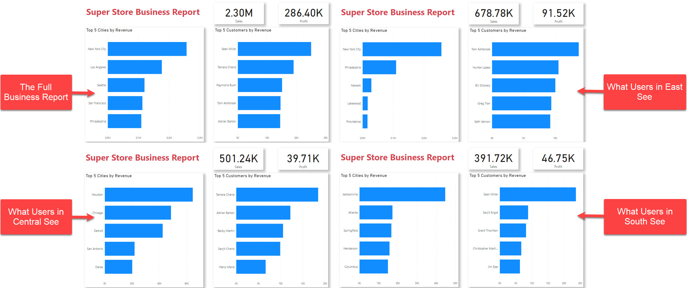
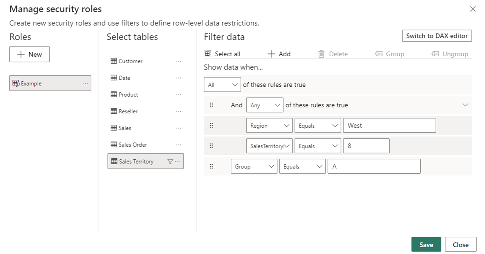
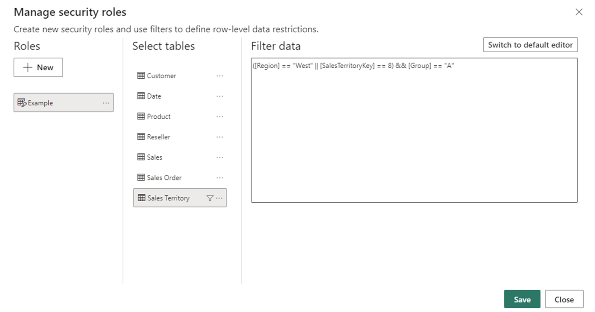
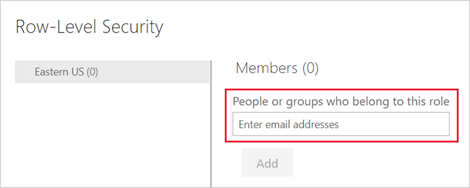

### What is Power BI?

**Power BI** is a tool by Microsoft that helps businesses understand their data. It turns raw numbers into easy-to-read charts and graphs.

With Power BI, you can:

-   **Connect to Data:** Get information from different sources like Excel or databases.

-   **Make Charts:** Create various charts and graphs to understand trends.

-   **Share Insights:** Share your findings with your team.

-   **Monitor in Real-Time:** Keep track of important numbers as they change.

You can download the [desktop application](https://powerbi.microsoft.com/en-us/desktop/).

 

### Dashboards

**Dashboards** in Power BI are like summary pages, showing the most important information at a glance, similar to a car dashboard.

The interface:

There are 3 main tabs on the LHS (from top to bottom):

1.  **Report:** You create reports and visuals, where most of your creation time is spent.
2.  **Data:** You see the tables, measures, and other data used in the data model associated with your report and transform the data fro best use in the report's model.
3.  **Model:** You see and manage the relationships among tables in your data model.

 

### Managing user access levels

Security in Power BI is crucial for safeguarding sensitive data and ensuring authorized access. With features like row-level security (RLS) and object-level security (OLS), organizations can enforce granular permissions, restricting access to specific data rows and objects within reports. This will only affect users with **Viewer** permissions and doesn't apply to *Admins*, *Members* or *Contributors*.

-   RLS allows you to restrict access to specific rows of data based on user attributes.

-   OLS enables you to control access to individual objects within a report or dashboard.

Together, these features provide powerful security controls to ensure that users only see the data they are authorized to access and interact with. However, there is no "page-level" security, you can limit what viewers see in the sense that there will be no visible drop-down menu link but they can still access the content if provided with the link, which they can copy and paste into a browser.

For example:

#### Assigning roles for RLS

RLS allows you to restrict access to rows of data based on the characteristics of the user viewing the data. For example, you might want to ensure that sales representatives can only see data for the customers they are responsible for.

1.  **Define Roles**: In Power BI Desktop, create roles and define RLS rules in the "Manage Roles" section.

 

This can be done using the in-built filters:

OR via DAX expressions:

2.  **Assign Users or Groups**: In the Power BI service, add users or groups to each role in the dataset settings.

3.  **Test and Validate**: Thoroughly test each role to ensure users only access authorized data.

#### Define permissions for OLS

OLS in Power BI is about controlling who can see and interact with specific parts of your reports and dashboards.

1.  **Identify Objects**: Determine which objects in your Power BI content need restricted access.

2.  **Define Access Permissions**: Decide who should view, edit, or interact with each object using roles.

 

3.  **Access Settings to Manage Permissions**: Navigate to workspace or report settings in Power BI. Set permissions for each object, specifying users or groups and their access level.

4.  **Test**: Ensure permissions work as intended by testing thoroughly.

 

#### Publish and maintain

Publish your report to the Power BI service, where the RLS and/or OLS rules are applied to the dataset. Regularly review and update roles as needed to adapt to changing requirements or user access patterns.

For more information, see the [official documentation](https://learn.microsoft.com/en-us/power-bi/enterprise/).
