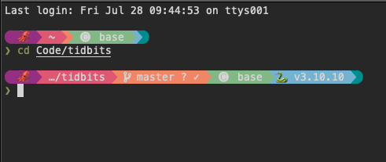
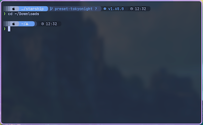

As part of my continuing quest to make my terminal [more colourful]({filename}/colourful_shell.md),
I've starting using [Starship](https://starship.rs/). Starship gives you a colourful,
customisable prompt, with lots of useful information about your current programming
environment, git branch, or shell built in.



## Installation

The best way to install **Starship** is to follow the [official instructions](https://starship.rs/guide/) - usually 
there's a single terminal command to install, plus another to set it up for your specific
shell.

You'll need a "nerd font" that has some extra symbols in it - find lots of options [here](https://www.nerdfonts.com/font-downloads).

## Configuration

Starship is configured through a configuration file at `~/.config/starship.toml`.
To get started, you can try one of the nice looking presets like Tokyo Night,
which can be set up automatically with a single command:

```bash
starship preset tokyo-night -o ~/.config/starship.toml
```



See [Starship's documentation](https://starship.rs/config/) for information
about how to tweak the prompt for specific languages and tools.