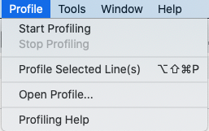
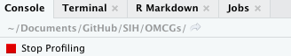
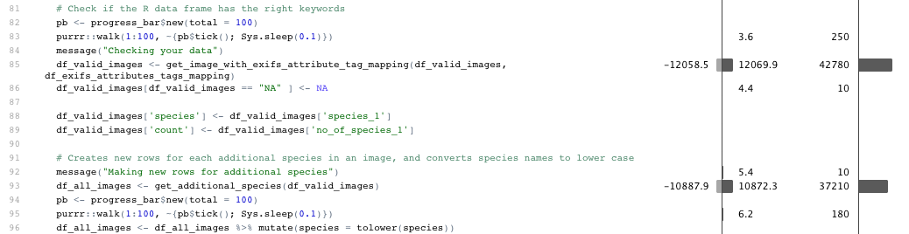
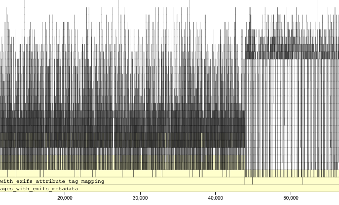
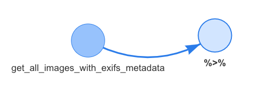
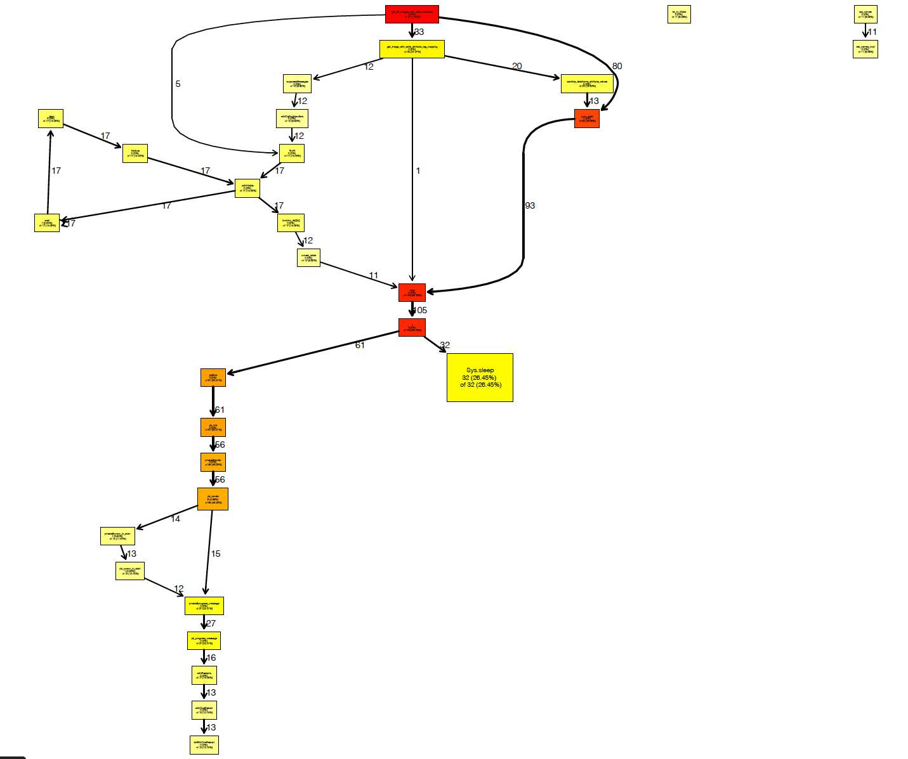

```{r setup, include=FALSE}
knitr::opts_chunk$set(echo = FALSE)
```

```{css, echo=FALSE}
pre {
  max-height: 300px;
  overflow-y: auto;
  max-width: 800px;
  overflow-x: auto;
}

pre[class] {
  max-height: 500px;
    max-width: 800px;
}
```

## Agenda for today:

1. Brief introduction to profiling, and why we might want to do it

2. Measuring function speed

3. Generating function profiles

4. Generating function call graphs

## Why might we need to profile our code

- Long functions can - *and will* - become hard to understand

- Clear documentation is difficult

- Something that makes sense to the creator...might make no sense to someone else

## What exactly is profiling?

*"Program analysis tools are extremely important for understanding program behavior. Computer architects need such tools to evaluate how well programs will perform on new architectures. Software writers need tools to analyze their programs and identify critical sections of code. Compiler writers often use such tools to find out how well their instruction scheduling or branch prediction algorithm is performing..."*

                                            —ATOM, PLDI, '94

- *"A statistical summary of the events observed"*, aka profile

- *"A stream of recorded events"*, aka trace

## A simple example

```{r simple example, eval=TRUE, echo=TRUE, message=TRUE}
MyFirstFunction <- function(x,
                            units
                            ){
  y <- (x*x)*pi
  
  message("A circle with a radius of ", x, " ", units)
  message("has an area of ", y, " ", units,"^2")
  return(y)
}

MyFirstFunction(42, "cm")
```

## How can to measure function speed?

Wrap function in **system.time()**?

```{r systemtime, eval=TRUE, echo=TRUE, message=FALSE}
system.time(MyFirstFunction(42,"yards"))
```
Hmm that isn't very precise. Thankfully, the **microbenchmark** package is much more precise:

```{r microbenchmark, eval=TRUE, echo=TRUE, message=FALSE, warning=FALSE}
library(microbenchmark)
microbenchmark(MyFirstFunction(42,"yards"))
```

## Scenario: complex function, confusing documentation

```{r complex function, echo=TRUE}
get_all_images_with_exifs_metadata <- function(images_directory_path,
                                               exifs_attributes_tags_path,
                                               output_path=NULL
)
{
  message("Gathering your images")
  pb <- progress_bar$new(total = 100)
  purrr::walk(1:100, ~{pb$tick(); Sys.sleep(0.1)})
  images_not_having_key_attributes <- c()

  count_of_not_processed_images <- 0

  exifs_tool_path <- Sys.which("exiftool")

  if (is.na(exifs_tool_path) || exifs_tool_path == '') {
    stop("exifs tool not installed. Install ExifTool from https://sno.phy.queensu.ca/~phil/exiftool/ before continue to use this package.",
      "\n")
  }

  # Read user specified attribute tags
  df_exifs_attributes_tags_mapping <- read_csv(exifs_attributes_tags_path, col_names = TRUE, col_types = cols()) %>%
    clean_names()

  # Convert attribute tag mapping to a valid dataframe
  pb <- progress_bar$new(total = 100)
  message("Looking for attribute tags")
  for (i in 1:nrow(df_exifs_attributes_tags_mapping)) {
    pb$tick(0)
    df_exifs_attributes_tags_mapping[i, 2] <- df_exifs_attributes_tags_mapping[i, 2] %>%
      make_clean_names()
  }
  exifs_tagged_attributes <- df_exifs_attributes_tags_mapping[[2]]
  exifs_tagged_attributes <- unlist(strsplit(exifs_tagged_attributes, split=", "))

  message("Processing your images")
  pb <- progress_bar$new(total = 100)
  purrr::walk(1:100, ~{pb$tick(); Sys.sleep(0.1)})
  df <- read_exif(images_directory_path, tags = c("FileName", "CreateDate", "DateTimeOriginal","FileSize", "Keywords"),
    recursive = TRUE, args = NULL, quiet = TRUE)
  # Clean up column names
  df <- df %>%
    separate(FileName, c("File", "Extension"), sep = "[.]") %>%
    mutate(Extension = tolower(Extension))
  df <- df %>%
    clean_names()

  # Filter only the jpg images
  df <- df %>%
    filter(extension == "jpg")

  # Filter only the images which have size greater than 0
  df_valid_images <- df %>%
    filter(file_size > 0)
  df_invalid_images <- df %>%
    filter(file_size == 0)

  # Check if the R data frame has the right keywords
  pb <- progress_bar$new(total = 100)
  purrr::walk(1:100, ~{pb$tick(); Sys.sleep(0.1)})
  message("Checking your data")
  df_valid_images <- get_image_with_exifs_attribute_tag_mapping(df_valid_images, df_exifs_attributes_tags_mapping)
  df_valid_images[df_valid_images == "NA" ] <- NA

  df_valid_images['species'] <- df_valid_images['species_1']
  df_valid_images['count'] <- df_valid_images['no_of_species_1']

  # Creates new rows for each additional species in an image, and converts species names to lower case
  message("Making new rows for additional species")
  df_all_images <- get_additional_species(df_valid_images)
  pb <- progress_bar$new(total = 100)
  purrr::walk(1:100, ~{pb$tick(); Sys.sleep(0.1)})
  df_all_images <- df_all_images %>% mutate(species = tolower(species))

  processed_count <- nrow(df_all_images)
  message("Images successfully wrangled")
  print(processed_count)
  return (df_all_images)
}
```

## What do we want to know about this function?

- What do all of the sub functions do?

- What order are the sub function called in?

- Where are the performanc bottlenecks?

- Are any bits of code not being used?

## Basic R profiling: Primary data collection tools

```{r basic profiling, echo= TRUE, eval = TRUE}
# Standard built in R profiling tools
library(profvis)
library(proftools)
```

```{r, fig.caption="Or use RStudio's GUI"}

```

## Basic R profiling: Create a profile of your function

```{r basic profiling example, eval=FALSE, echo=TRUE}
Rprof(filename = "demo_prof.out", # file name for your profile
      append= FALSE,
      interval = 0.02,
      line.profiling = TRUE)
# Run the function you want to profile
test <- get_all_images_with_exifs_metadata(
  "/Users/hlyd4326/Desktop/Some_files",
  "/Users/hlyd4326/Desktop/A_spreadsheet.csv")
# Click on the red box in the console in R studio to end profiling.
```

```{r red clicky box, eval=TRUE, out.width = "400px"}

```

## Basic R profiling: Results


```{r example profile, out.width = "800px"}


```


## Basic R profiling: Flame Graph

```{r rainbow flame graph, eval = TRUE, echo = TRUE}
pd <- readProfileData("demo_prof.out")
flameGraph(pd)
```

## What did I learn from using R studio's default profiling tools?

- Certain portions of the function accounted for the bulk of memory consumption and compute time.

- The memory utilization did not appear to be optimized: only 12gb of 64gb available RAM were used.
  - The inverse of this is that the function should run ok on far less powerful machines.
  
I still had some questions about how this function was working, so I went to look for more solutions.


## What about some sort of call graph?

- Call graphs are a type of control flow diagram, and help us visualise how computer processes function.

- Commonly used in software development to analyse code and improve documentation.

- What tools exist for generating these reports in R?

## One possibility: visNetwork function dependency graph
```{r Dependencies example, eval = FALSE, echo = TRUE}
library(DependenciesGraphs)
deps1 <- funDependencies("package:exifpro2camtrapr","get_all_images_with_exifs_metadata")
plot(deps1)
```

```{r, fig.caption="Slick output, but the call graph seems confused by the pipe"}

```

## Pilgrimage to Bioconductor to find solutions

After much Googling, I found a solution in the documentation of the **proftools** package: a profile call graph function called **plotProfileCallGraph()**. 

However, it requires two packages that are not in the CRAN ecosystem. To Bioconductor we go!

```{r Bioconductor packages, eval=FALSE, echo=TRUE}
# Here's how to install from Bioconductor:
# install.packages("BiocManager")
# BiocManager::install()

library(graph)
library(Rgraphviz)
```

## A call graph that overcomes the pipe

```{r first call graph, eval=TRUE, echo=TRUE}
graph1 <- plotProfileCallGraph(pd)
```


## A call graph that overcomes the pipe

```{r original call graph, out.width = "600px", out.height="500px"}

```


## How did call graphs help my code?

- They helped me recognize the order in which sub functions and helper functions were called.

- They helped confirm that some portions of code were useless.


However, in the end the code had to be scrapped because of fundamental issues.

## Conclusions

- Profiling can help you understand what your code is doing, and when.

- Call graphs can help you visualize complex functions.

- Neither are a substitute for good coding practices.

## R packages 

```{r package list, eval = FALSE, echo= TRUE}
# Precise speed metrics
library(microbenchmark) 
# Basic profiling tools
library(profvis)
library(proftools)
# Support for call graphs
library(DependenciesGraphs)
library(graph)
library(Rgraphviz)
```
```{r echo=TRUE,eval=FALSE}
         /  /\        ___          /__/\ Thanks
        /  /:/_      /  /\         \  \:\  for
       /  /:/ /\    /  /:/          \__\:\   coming!
      /  /:/ /::\  /__/::\      ___ /  /::\    if
     /__/:/ /:/\:\ \__\/\:\__  /__/\  /:/\:\  you want the slides
     \  \:\/:/~/:/    \  \:\/\ \  \:\/:/__\/   they are going to
      \  \::/ /:/      \__\::/  \  \::/       be on GitHub.
       \__\/ /:/       /__/:/    \  \:\
         /__/:/        \__\/      \  \:\
         \__\/                     \__\/
```

